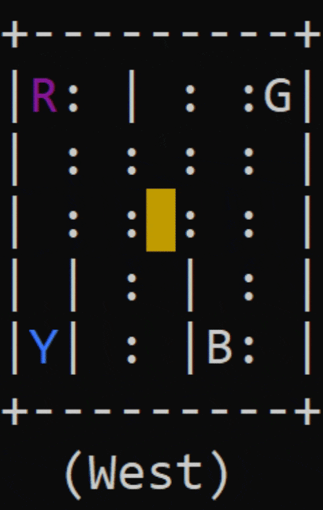

# Taxi-V3

## Environment:
The Taxi Problem from "Hierarchical Reinforcement Learning with the MAXQ Value Function Decomposition" by Tom Dietterich <br>
This task was introduced in [Dietterich2000] to illustrate some issues in hierarchical reinforcement learning. <br>
There are four designated locations in the grid world indicated by R(ed), G(reen), Y(ellow), and B(lue). When the episode starts, the taxi starts off at a random square and the passenger is at a random location. The taxi drives to the passenger's location, picks up the passenger, drives to the passenger's destination (another one of the four specified locations), and then drops off the passenger. Once the passenger is dropped off, the episode ends.
<br>You receive +20 points for a successful dropoff, and lose 1 point for every timestep it takes. There is also a 10 point penalty for illegal pick-up and drop-off actions.<br>

## State Space:
There are 500 discrete states since there are 25 taxi positions, 5 possible locations of the passenger (including the case when the passenger is in the taxi), and 4 destination locations.
<br>Note that there are 400 states that can actually be reached during an episode. The missing states correspond to situations in which the passenger is at the same location as their destination, as this typically signals the end of an episode.
<br>Four additional states can be observed right after a successful episodes, when both the passenger and the taxi are at the destination.
<br>This gives a total of 404 reachable discrete states.<br>
    Passenger locations:<br>
    - 0: R(ed)<br>
    - 1: G(reen)<br>
    - 2: Y(ellow)<br>
    - 3: B(lue)<br>
    - 4: in taxi<br>
    Destinations:<br>
    - 0: R(ed)<br>
    - 1: G(reen)<br>
    - 2: Y(ellow)<br>
    - 3: B(lue)<br>
The state space is represented by: (taxi_row, taxi_col, passenger_location, destination)
## Action Space:
There are 6 discrete deterministic actions: <br>
    - 0: move south<br>
    - 1: move north<br>
    - 2: move east<br>
    - 3: move west<br>
    - 4: pickup passenger<br>
    - 5: drop off passenger<br>
## Citation:
```
[Dietterich2000]
T Erez, Y Tassa, E Todorov, "Hierarchical Reinforcement Learning with the MAXQ Value Function Decomposition", 2011
```
## Source code for environment:
https://github.com/openai/gym/blob/master/gym/envs/toy_text/taxi.py
